### Hi there 👋
I'm Dylan Liu, working as staff at HQU, with interests in information security, IOT, software engineering and etc.

### My Programming Status 😎
<!--START_SECTION:waka-->


**🐱 My GitHub Data** 

> 📦 366.8 kB Used in GitHub's Storage 
 > 
> 🏆 64 Contributions in the Year 2026
 > 
> 🚫 Not Opted to Hire
 > 
> 📜 28 Public Repositories 
 > 
> 🔑 32 Private Repositories 
 > 
**I'm a Night 🦉** 

```text
🌞 Morning                812 commits         ⬛⬛⬛⬛⬛⬛⬛⬛⬛⬛⬜⬜⬜⬜⬜⬜⬜⬜⬜⬜⬜⬜⬜⬜⬜   39.32 % 
🌆 Daytime                215 commits         ⬛⬛⬛⬜⬜⬜⬜⬜⬜⬜⬜⬜⬜⬜⬜⬜⬜⬜⬜⬜⬜⬜⬜⬜⬜   10.41 % 
🌃 Evening                883 commits         ⬛⬛⬛⬛⬛⬛⬛⬛⬛⬛⬛⬜⬜⬜⬜⬜⬜⬜⬜⬜⬜⬜⬜⬜⬜   42.76 % 
🌙 Night                  155 commits         ⬛⬛⬜⬜⬜⬜⬜⬜⬜⬜⬜⬜⬜⬜⬜⬜⬜⬜⬜⬜⬜⬜⬜⬜⬜   07.51 % 
```
📅 **I'm Most Productive on Thursday** 

```text
Monday                   311 commits         ⬛⬛⬛⬛⬜⬜⬜⬜⬜⬜⬜⬜⬜⬜⬜⬜⬜⬜⬜⬜⬜⬜⬜⬜⬜   15.06 % 
Tuesday                  302 commits         ⬛⬛⬛⬛⬜⬜⬜⬜⬜⬜⬜⬜⬜⬜⬜⬜⬜⬜⬜⬜⬜⬜⬜⬜⬜   14.62 % 
Wednesday                290 commits         ⬛⬛⬛⬛⬜⬜⬜⬜⬜⬜⬜⬜⬜⬜⬜⬜⬜⬜⬜⬜⬜⬜⬜⬜⬜   14.04 % 
Thursday                 326 commits         ⬛⬛⬛⬛⬜⬜⬜⬜⬜⬜⬜⬜⬜⬜⬜⬜⬜⬜⬜⬜⬜⬜⬜⬜⬜   15.79 % 
Friday                   254 commits         ⬛⬛⬛⬜⬜⬜⬜⬜⬜⬜⬜⬜⬜⬜⬜⬜⬜⬜⬜⬜⬜⬜⬜⬜⬜   12.30 % 
Saturday                 288 commits         ⬛⬛⬛⬜⬜⬜⬜⬜⬜⬜⬜⬜⬜⬜⬜⬜⬜⬜⬜⬜⬜⬜⬜⬜⬜   13.95 % 
Sunday                   294 commits         ⬛⬛⬛⬛⬜⬜⬜⬜⬜⬜⬜⬜⬜⬜⬜⬜⬜⬜⬜⬜⬜⬜⬜⬜⬜   14.24 % 
```


**I Mostly Code in C++** 

```text
C++                      19 repos            ⬛⬛⬛⬛⬛⬛⬛⬛⬛⬛⬛⬜⬜⬜⬜⬜⬜⬜⬜⬜⬜⬜⬜⬜⬜   43.18 % 
C                        7 repos             ⬛⬛⬛⬛⬜⬜⬜⬜⬜⬜⬜⬜⬜⬜⬜⬜⬜⬜⬜⬜⬜⬜⬜⬜⬜   15.91 % 
Python                   5 repos             ⬛⬛⬛⬜⬜⬜⬜⬜⬜⬜⬜⬜⬜⬜⬜⬜⬜⬜⬜⬜⬜⬜⬜⬜⬜   11.36 % 
CMake                    3 repos             ⬛⬛⬜⬜⬜⬜⬜⬜⬜⬜⬜⬜⬜⬜⬜⬜⬜⬜⬜⬜⬜⬜⬜⬜⬜   06.82 % 
JavaScript               3 repos             ⬛⬛⬜⬜⬜⬜⬜⬜⬜⬜⬜⬜⬜⬜⬜⬜⬜⬜⬜⬜⬜⬜⬜⬜⬜   06.82 % 
```


**Timeline**


<!--END_SECTION:waka-->

<div align="center"><a>
  
</a>
<a>
  
</a></div>

<picture>
  <source media="(prefers-color-scheme: dark)" srcset="https://github.com/mentalfl0w/mentalfl0w/raw/snake/github-contribution-grid-snake-dark.svg" />
  <source media="(prefers-color-scheme: light)" srcset="https://github.com/mentalfl0w/mentalfl0w/raw/snake/github-contribution-grid-snake.svg" />
  
</picture>

### My projects 🔮

1. Allows you to use DLLN3X ZigBee mesh module very easily:

    [](https://github.com/mentalfl0w/DLLN3X_zigbee_mesh_module_library)

    > **Note:** This library is now complete, supports basic message sending and receiving, module address reading, on-chip red led flashing control, configuration reading, modification (baud rate, address, etc.), error report, link quality test, on-chip pin control, welcome feedback by opening issues.

2. A library of controls written in QML and designed with reference to the Microsoft Ribbon style:

    [](https://github.com/mentalfl0w/RibbonUI)

3. Other items to be added.

### Get in touch 📧

[](https://blog.ourdocs.cn/)
[](https://github.com/mentalfl0w)
[](mailto:mentalflow@ourdocs.cn)

### Support my development ⬆️
You can buy me a coffee to support my development😉(Click [here](https://afdian.com/a/mentalfl0w) to afdian or scan the QR Code.)
<div align="center">
    
</div>

