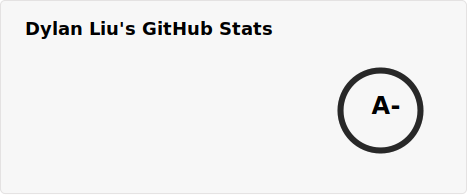
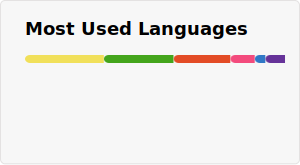
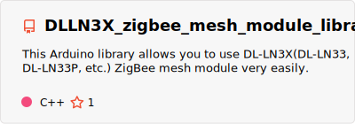
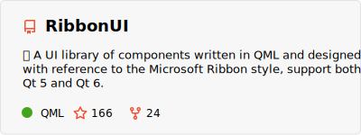

### Hi there 👋
I'm Dylan Liu, working as staff at HQU, with interests in information security, IOT, software engineering and etc.

### My Programming Status 😎
<!--START_SECTION:waka-->


**🐱 My GitHub Data** 

> 📦 365.5 kB Used in GitHub's Storage 
 > 
> 🏆 1,091 Contributions in the Year 2026
 > 
> 🚫 Not Opted to Hire
 > 
> 📜 29 Public Repositories 
 > 
> 🔑 30 Private Repositories 
 > 
**I'm a Night 🦉** 

```text
🌞 Morning                992 commits         ⬛⬛⬛⬛⬛⬛⬛⬛⬛⬛⬜⬜⬜⬜⬜⬜⬜⬜⬜⬜⬜⬜⬜⬜⬜   40.86 % 
🌆 Daytime                219 commits         ⬛⬛⬜⬜⬜⬜⬜⬜⬜⬜⬜⬜⬜⬜⬜⬜⬜⬜⬜⬜⬜⬜⬜⬜⬜   09.02 % 
🌃 Evening                1060 commits        ⬛⬛⬛⬛⬛⬛⬛⬛⬛⬛⬛⬜⬜⬜⬜⬜⬜⬜⬜⬜⬜⬜⬜⬜⬜   43.66 % 
🌙 Night                  157 commits         ⬛⬛⬜⬜⬜⬜⬜⬜⬜⬜⬜⬜⬜⬜⬜⬜⬜⬜⬜⬜⬜⬜⬜⬜⬜   06.47 % 
```
📅 **I'm Most Productive on Thursday** 

```text
Monday                   362 commits         ⬛⬛⬛⬛⬜⬜⬜⬜⬜⬜⬜⬜⬜⬜⬜⬜⬜⬜⬜⬜⬜⬜⬜⬜⬜   14.91 % 
Tuesday                  353 commits         ⬛⬛⬛⬛⬜⬜⬜⬜⬜⬜⬜⬜⬜⬜⬜⬜⬜⬜⬜⬜⬜⬜⬜⬜⬜   14.54 % 
Wednesday                342 commits         ⬛⬛⬛⬛⬜⬜⬜⬜⬜⬜⬜⬜⬜⬜⬜⬜⬜⬜⬜⬜⬜⬜⬜⬜⬜   14.09 % 
Thursday                 379 commits         ⬛⬛⬛⬛⬜⬜⬜⬜⬜⬜⬜⬜⬜⬜⬜⬜⬜⬜⬜⬜⬜⬜⬜⬜⬜   15.61 % 
Friday                   305 commits         ⬛⬛⬛⬜⬜⬜⬜⬜⬜⬜⬜⬜⬜⬜⬜⬜⬜⬜⬜⬜⬜⬜⬜⬜⬜   12.56 % 
Saturday                 338 commits         ⬛⬛⬛⬜⬜⬜⬜⬜⬜⬜⬜⬜⬜⬜⬜⬜⬜⬜⬜⬜⬜⬜⬜⬜⬜   13.92 % 
Sunday                   349 commits         ⬛⬛⬛⬛⬜⬜⬜⬜⬜⬜⬜⬜⬜⬜⬜⬜⬜⬜⬜⬜⬜⬜⬜⬜⬜   14.37 % 
```


**I Mostly Code in C++** 

```text
C++                      21 repos            ⬛⬛⬛⬛⬛⬛⬛⬛⬛⬛⬛⬜⬜⬜⬜⬜⬜⬜⬜⬜⬜⬜⬜⬜⬜   45.65 % 
C                        6 repos             ⬛⬛⬛⬜⬜⬜⬜⬜⬜⬜⬜⬜⬜⬜⬜⬜⬜⬜⬜⬜⬜⬜⬜⬜⬜   13.04 % 
Python                   5 repos             ⬛⬛⬛⬜⬜⬜⬜⬜⬜⬜⬜⬜⬜⬜⬜⬜⬜⬜⬜⬜⬜⬜⬜⬜⬜   10.87 % 
CMake                    3 repos             ⬛⬛⬜⬜⬜⬜⬜⬜⬜⬜⬜⬜⬜⬜⬜⬜⬜⬜⬜⬜⬜⬜⬜⬜⬜   06.52 % 
JavaScript               3 repos             ⬛⬛⬜⬜⬜⬜⬜⬜⬜⬜⬜⬜⬜⬜⬜⬜⬜⬜⬜⬜⬜⬜⬜⬜⬜   06.52 % 
```


**Timeline**


<!--END_SECTION:waka-->

<div align="center"><a>
  
</a>
<a>
  
</a></div>

<picture>
  <source media="(prefers-color-scheme: dark)" srcset="https://github.com/mentalfl0w/mentalfl0w/raw/snake/github-contribution-grid-snake-dark.svg" />
  <source media="(prefers-color-scheme: light)" srcset="https://github.com/mentalfl0w/mentalfl0w/raw/snake/github-contribution-grid-snake.svg" />
  
</picture>

### My projects 🔮

1. Allows you to use DLLN3X ZigBee mesh module very easily:

    [](https://github.com/mentalfl0w/DLLN3X_zigbee_mesh_module_library)

    > **Note:** This library is now complete, supports basic message sending and receiving, module address reading, on-chip red led flashing control, configuration reading, modification (baud rate, address, etc.), error report, link quality test, on-chip pin control, welcome feedback by opening issues.

2. A library of controls written in QML and designed with reference to the Microsoft Ribbon style:

    [](https://github.com/mentalfl0w/RibbonUI)

3. Other items to be added.

### Get in touch 📧

[](https://blog.ourdocs.cn/)
[](https://github.com/mentalfl0w)
[](mailto:mentalflow@ourdocs.cn)
